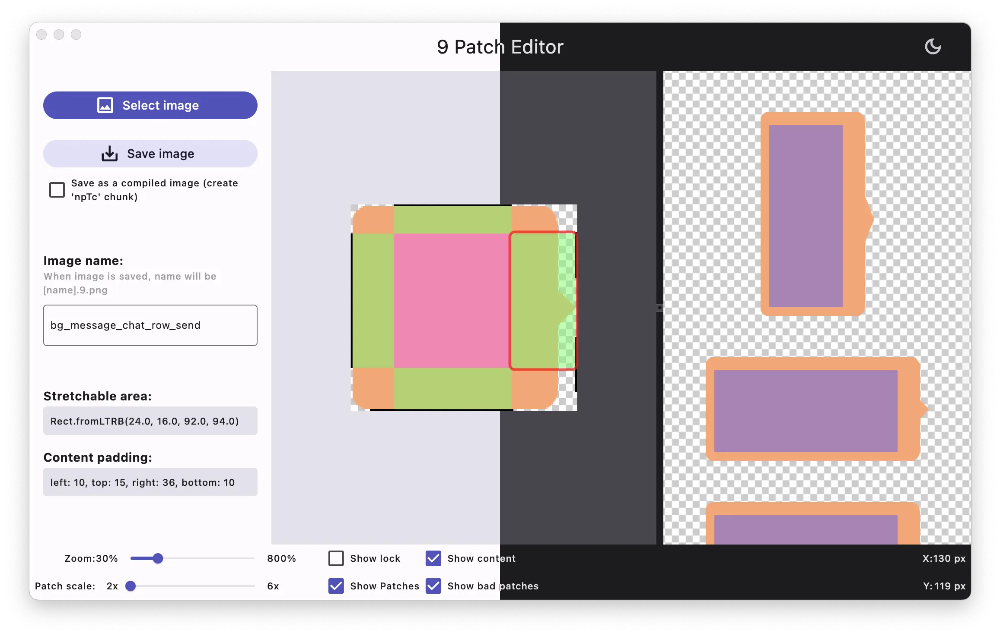

# 9 Patch Editor

A tool that provides similar features to editing 9 patch images in Android Studio.



## Environment

```console
➜  ~ % flutter --version
Flutter 3.19.6 • channel stable • https://github.com/flutter/flutter.git
Framework • revision 54e66469a9 (5 weeks ago) • 2024-04-17 13:08:03 -0700
Engine • revision c4cd48e186
Tools • Dart 3.3.4 • DevTools 2.31.1
➜  ~ % flutter doctor
Doctor summary (to see all details, run flutter doctor -v):
[✓] Flutter (Channel stable, 3.22.0, on macOS 14.5 23F79 darwin-arm64 (Rosetta), locale zh-Hans-CN)
[✓] Android toolchain - develop for Android devices (Android SDK version 34.0.0)
[✓] Xcode - develop for iOS and macOS (Xcode 15.4)
[✓] Chrome - develop for the web
[✓] Android Studio (version 2023.3)
[✓] VS Code (version 1.89.1)
[✓] Connected device (2 available)
[✓] Network resources
```
