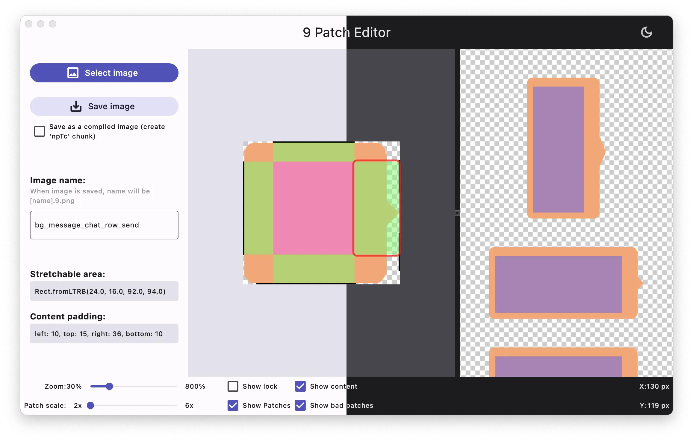

# 9 Patch Editor

A tool that provides similar features to editing 9 patch images in Android Studio.



## Environment

```console
➜  ~ % flutter --version
Flutter 3.19.4 • channel stable • https://github.com/flutter/flutter.git
Framework • revision 68bfaea224 (2 days ago) • 2024-03-20 15:36:31 -0700
Engine • revision a5c24f538d
Tools • Dart 3.3.2 • DevTools 2.31.1
➜  ~ % flutter doctor
Doctor summary (to see all details, run flutter doctor -v):
[✓] Flutter (Channel stable, 3.19.4, on macOS 13.6.5 22G621 darwin-x64, locale zh-Hans-CN)
[✓] Android toolchain - develop for Android devices (Android SDK version 34.0.0)
[✓] Xcode - develop for iOS and macOS (Xcode 15.2)
[✓] Chrome - develop for the web
[✓] Android Studio (version 2023.2)
[✓] VS Code (version 1.87.2)
[✓] Connected device (2 available)
[✓] HTTP Host Availability
```
